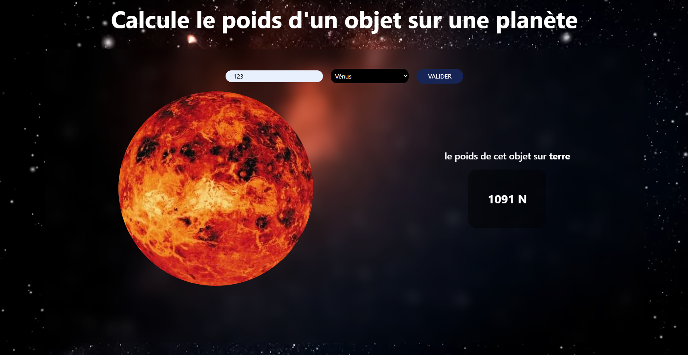

# 🌌 Calculateur de Poids Planétaire

Une application web interactive qui permet de **calculer le poids d’un objet sur différentes planètes du système solaire** à partir de sa masse en kilogrammes (kg). Idéal pour les passionnés de science, d’astronomie ou simplement pour apprendre les effets de la gravité ailleurs que sur Terre !

---

## 🚀 Fonctionnalités

- 🌍 Choix de la planète (Terre, Vénus, Mars, etc.)
- ⚖️ Entrée de la masse de l’objet
- 🌌 Calcul automatique du poids selon la gravité spécifique de chaque planète
- 🎨 Interface visuelle immersive avec fond spatial
- 🖼️ Affichage dynamique de l’image de la planète sélectionnée

---

## 🛠️ Technologies utilisées

- **HTML5** — Structure de la page
- **CSS3** — Design responsive, animations et effets visuels
- **JavaScript** — Logique de calcul et interaction utilisateur

---

## 📚 Formule utilisée
Le poids (en Newton) est calculé par la formule :

Poids = masse (kg) × gravité (m/s²)
Par exemple, sur Terre :
Poids = 123 kg × 9.81 ≈ 1206 N

## 🌍 Gravité des planètes utilisées
Planète	Gravité (m/s²)
- Mercure	3.7
- Vénus	8.87
- Terre	9.81
- Mars	3.71
- Jupiter	24.79
- Saturne	10.44
- Uranus	8.69
- Neptune	11.15

## 🤝 Contribuer
Les contributions sont les bienvenues !
Tu peux proposer des améliorations de code, corriger des bugs ou ajouter de nouvelles planètes.

## 👨‍💻 Auteur
Développé par [nicostar-lab](https://github.com/nicostar-lab)
